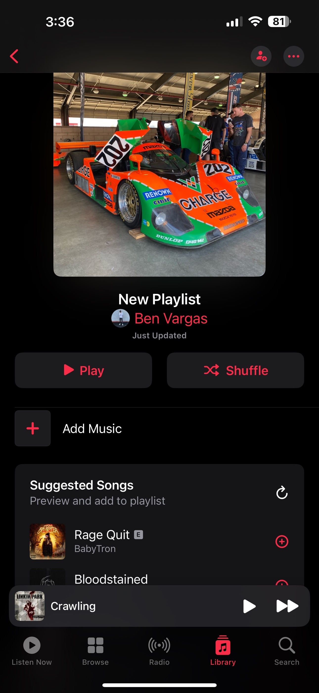
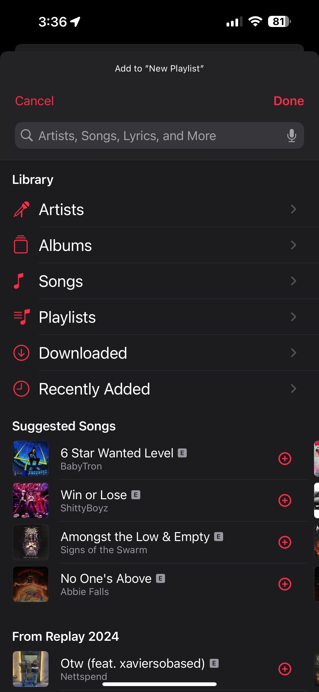
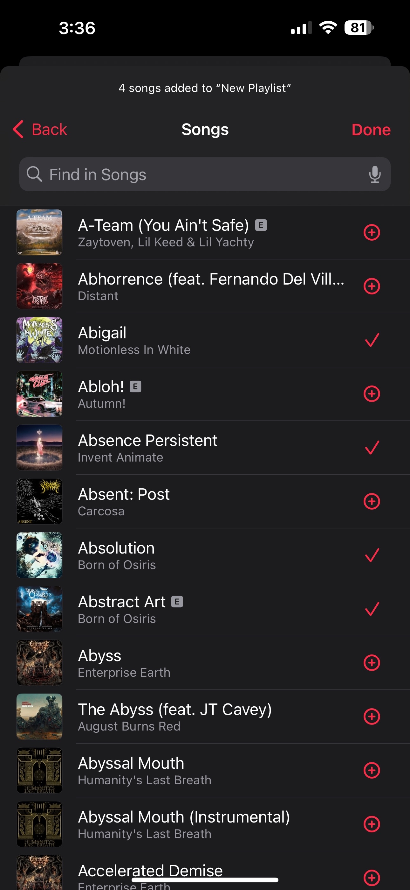
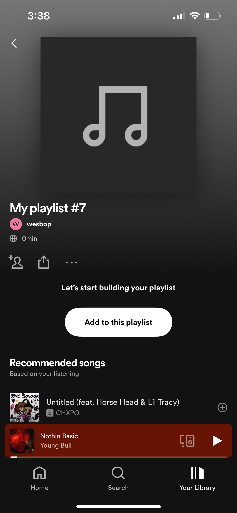
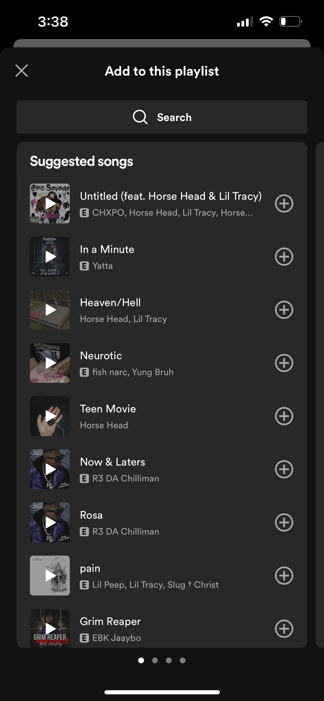

# Creating a playlist
## Wesley Casebeer, 3/16/2024
I used Apple Music for a long time for listening to music on my phone/computer, until I eventually made the switch to Spotify for the discounted user price and a far better Windows desktop application. I have enjoyed Spotify for the most part, it does very well in finding me new music, and it feels very satisfying and easy to use. 

I quickly figured out, though, that Spotify had one glaring weakness, and it came up when I was trying to make a playlist. The methods of making a playlist are very **inefficient** using Spotify, it can't be done nearly as quickly as it should be able to, and it becomes a serious problem when trying to make very large playlists, and I am someone who finds myself making playlists of 500+ songs, so this is a massive issue for me. 

When using Apple Music and making a playlist from scratch, you can press a button to add songs, and it will recommend some songs to add to your playlist and give you the typical methods of accessing music that you usually have, by scrolling through a list of songs, albums, artists, etc. You can click each song you want to add and it adds a checkmark next to it, then once you have selected all of the songs you'd like to add, you click one more button and they are all added to the playlist.

 
Playlist we are working on.

 
This is the screen that shows after clicking "add music" on the previous screen, allowing selection of many different choices for sorting music: Artists, Albums, etc.

 
After selecting an album to add music from, you can simply click the "+" on the right side of each screen to add each song you would like from that album.

 
Another option as opposed to the previous one is clicking "songs", this lists every individual song, with the "+" next to each of them.

Using spotify, when you click to add music to a playlist, the option to scroll through your library is entirely absent. You are only given a list of songs it recommends you add to your playlist, and the ability to search for songs by name. 

 
Playlist we are working on.

 
After clicking "add to this playlist," there is no option at all to look through all of the music you have added to your library. It simply shows you a few random songs as options, and allows you to search for songs, there is no option to look at all the music from a certain artist or a certain album.

Beyond this, the only other option for adding a song to a playlist is to go to the song itself outside of the "add to this playlist" functionality and go through at least four button presses per song to add it to a playlist. This process is so **inefficient** that I have resorted to asking to use my friend's Apple Music account to create playlists, then using an online playlist converter to make it into a spotify playlist for myself. 

It is beyond me why it works this way, because I would imagine that after clicking the "add to this playlist" button, the first thing most people would want is to be able to scroll through their library, instead of trying to create an entire playlist using only songs off of the top of their head combined with songs recommended to them by Spotify. I'd imagine it isn't a difficult functionality to add, and it would make my experience, and likely many others', a lot better using Spotify.
